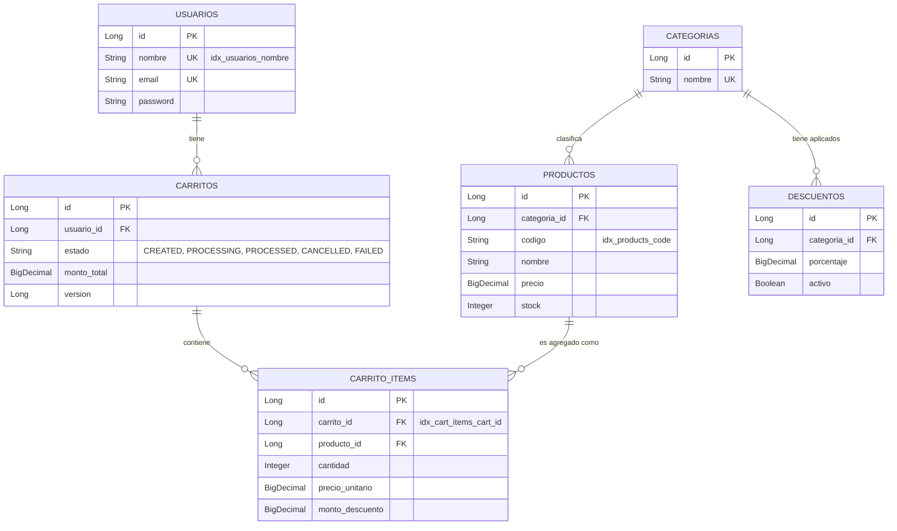

Aquí tienes el archivo `README.md` completo y mejorado, incorporando el Diagrama de Entidad-Relación (DER) para que cualquier desarrollador que entre al repositorio entienda rápidamente tanto la arquitectura de concurrencia como el modelo de datos.

```markdown
# 🛒 Tienda E-Commerce Backend (High Concurrency Ready)

API REST robusta construida con **Spring Boot**, diseñada específicamente para procesar órdenes de compra asíncronas y soportar escenarios de alta concurrencia (*Stress-Tested*). El sistema garantiza la integridad transaccional y previene problemas clásicos del comercio electrónico como la sobreventa (*overselling*) o las condiciones de carrera (*race conditions*).

---

## 🚀 Características Principales

* **Autenticación Stateless:** Seguridad mediante tokens JWT, procesando *Claims* en memoria para liberar el pool de conexiones de la base de datos.
* **Procesamiento de Órdenes Asíncrono:** Uso de trabajadores en segundo plano (`@Async`) para aislar la capa HTTP del procesamiento de la orden, mejorando el *throughput* del servidor.
* **Prevención de Sobreventa (Overselling):** Resta atómica de inventario directamente en el motor SQL (*Compare-And-Swap*) bajo el principio *Fail-Fast*.
* **Control de Concurrencia de Usuarios:** Bloqueo Optimista (`@Version` de JPA) para prevenir que modificaciones simultáneas en múltiples pestañas del navegador corrompan el estado del carrito.
* **Transacciones de Dominio Limpias:** Manejo explícito de excepciones de negocio (`noRollbackFor = OutOfStockException.class`) para registrar auditorías exactas sin provocar *rollbacks* destructivos en la base de datos.

---

## 🛠️ Stack Tecnológico

* **Framework:** Java / Spring Boot 3.x
* **Seguridad:** Spring Security + JWT
* **Persistencia:** Spring Data JPA / Hibernate
* **Base de Datos:** H2 (Memoria) / PostgreSQL (Producción)
* **Connection Pooling:** HikariCP (Optimizado para concurrencia)
* **Testing:** JUnit 5, Mockito, Apache JMeter (Pruebas de Carga)

---

## 🗄️ Esquema de Base de Datos (DER)

El modelo relacional está diseñado para garantizar la inmutabilidad de los precios y descuentos al momento del *checkout*, separando claramente el catálogo activo de las órdenes procesadas.



---

## 🏗️ Arquitectura de Concurrencia

El sistema utiliza un enfoque de **Defensa en Profundidad** para manejar peticiones masivas:

1. **Capa Web (Filtro JWT):** Verifica permisos sin tocar la base de datos, reteniendo las conexiones HTTP al mínimo.
2. **Capa de Servicio (Transición Atómica):** Valida que un carrito no se envíe a procesar dos veces al mismo tiempo cambiando su estado a `PROCESSING` con una actualización SQL directa.
3. **Fondo de Trabajo (OrderProcessingWorker):** Hilos separados procesan los pagos y agotan el stock garantizando que el `UPDATE` a la base de datos verifique si el stock resultante es `>= 0`. Si un producto se agota, se lanza una excepción de negocio que cancela limpiamente el carrito de compra.

---

## 📊 Pruebas de Estrés y Rendimiento (JMeter)

El sistema ha sido sometido a pruebas de carga reales utilizando **Apache JMeter**, simulando el peor escenario posible: un ataque masivo de compras sobre un inventario limitado.

**Escenario de Prueba:**

* **Usuarios Concurrentes:** 100 usuarios intentando procesar carritos independientes simultáneamente.
* **Inventario Disponible:** 90 unidades de `PROD-001`.
* **Configuración del Pool:** HikariCP ajustado a 30 conexiones (`maximum-pool-size: 30`) para evitar embotellamientos transaccionales.

**Resultados Oficiales:**

* ✅ **Órdenes Procesadas Exitosamente:** Exactamente `90` carritos terminaron en estado `PROCESSED`.
* ✅ **Órdenes Rechazadas Limpiamente:** Exactamente `10` carritos terminaron en estado `CANCELLED` por reglas de negocio (*Out of stock*).
* ✅ **Sobreventa (Overselling):** `0`. El inventario en la tabla `productos` nunca quedó en números negativos.
* ✅ **Errores Críticos (500):** `0`. El manejo de transacciones con `noRollbackFor` previno bloqueos y excepciones inesperadas de rollback, permitiendo que la aplicación absorbiera la carga completa sin afectar la estabilidad.

---

## 💻 Instalación y Uso Local

**1. Clonar el repositorio:**

```bash
git clone [https://github.com/tu-usuario/tienda-ecommerce.git](https://github.com/tu-usuario/tienda-ecommerce.git)
cd tienda-ecommerce

```

**2. Configurar Propiedades (opcional):**
El archivo `application.yml` ya está optimizado con los parámetros necesarios para correr el pool de conexiones de Hikari adecuadamente para pruebas locales.

**3. Compilar y Ejecutar:**

```bash
./mvnw clean install
./mvnw spring-boot:run

```

**4. Endpoints Principales:**

* `POST /api/auth/login` - Obtención de JWT
* `POST /api/carts` - Creación de carrito
* `POST /api/carts/{cartId}/products` - Agregado de productos al carrito
* `POST /api/carts/{cartId}/process` - *Checkout* asíncrono (Retorna HTTP 202 Accepted)

```

```