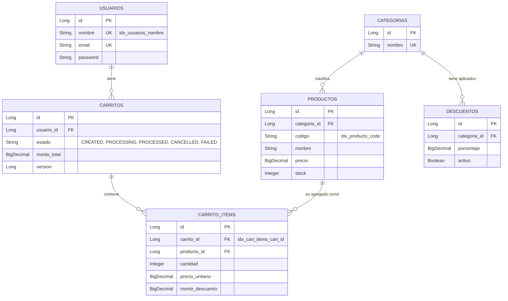

Aquí tienes el **`README.md`** final y pulido.

He revisado las clases clave que proporcionaste e incluí menciones a los detalles arquitectónicos avanzados que estás utilizando (como `@Retryable` para bloqueos optimistas, propagación `REQUIRES_NEW` para aislar los errores, y la caché de Caffeine). Además, agregué las secciones específicas para **Swagger** y **Postman**.

```markdown
# 🛒 Tienda E-Commerce Backend (High Concurrency Ready)

API REST robusta construida con **Spring Boot**, diseñada específicamente para procesar órdenes de compra asíncronas y soportar escenarios de alta concurrencia (*Stress-Tested*). El sistema garantiza la integridad transaccional y previene problemas clásicos del comercio electrónico como la sobreventa (*overselling*) o las condiciones de carrera (*race conditions*).

---

## 🚀 Características Principales

* **Autenticación Stateless:** Seguridad mediante tokens JWT, procesando *Claims* (como el `userId`) en memoria para liberar el pool de conexiones de la base de datos.
* **Procesamiento de Órdenes Asíncrono:** Uso de trabajadores en segundo plano (`@Async`) con un *Thread Pool* dedicado (Core: 10, Max: 50, Cola: 100) para aislar la capa HTTP de las transacciones pesadas.
* **Prevención de Sobreventa (Overselling):** Resta atómica de inventario directamente en el motor SQL (*Compare-And-Swap*) bajo el principio *Fail-Fast*.
* **Resiliencia ante Concurrencia (Optimistic Locking & Retry):** Uso de `@Version` de JPA para detectar colisiones en el carrito, respaldado por una política `@Retryable` que reintenta la operación automáticamente hasta 3 veces antes de fallar.
* **Transacciones de Dominio y Aislamiento:** Manejo explícito de excepciones de negocio (`noRollbackFor = OutOfStockException.class`) y uso de propagación `REQUIRES_NEW` para garantizar que los estados `CANCELLED` o `FAILED` se guarden siempre, asegurando el rastro de auditoría.
* **Rendimiento Extremo con Virtual Threads:** Hilos virtuales de Project Loom habilitados a nivel de framework para maximizar la capacidad de peticiones concurrentes con un impacto mínimo en memoria.
* **Estrategia de Caché Local:** Integración de **Caffeine Cache** (`activeDiscounts`) para mantener los descuentos en memoria (con expiración de 10 minutos), evitando consultas repetitivas a la base de datos durante el *checkout*.

---

## 🛠️ Stack Tecnológico

* **Framework:** Java / Spring Boot 3.x (Virtual Threads Enabled)
* **Seguridad:** Spring Security + JWT
* **Persistencia:** Spring Data JPA / Hibernate
* **Base de Datos:** H2 (Memoria) / PostgreSQL (Producción)
* **Caché:** Caffeine
* **Connection Pooling:** HikariCP (Optimizado para concurrencia)
* **Documentación y Observabilidad:** Springdoc OpenAPI (Swagger), Spring Boot Actuator, Prometheus
* **Testing:** JUnit 5, Mockito, Apache JMeter (Pruebas de Carga)

---

## 🗄️ Esquema de Base de Datos (DER)

El modelo relacional está diseñado para garantizar la inmutabilidad de los precios y descuentos al momento del *checkout*, separando claramente el catálogo activo de las órdenes procesadas.



---

## 🏗️ Arquitectura de Concurrencia

El sistema utiliza un enfoque de **Defensa en Profundidad** para manejar peticiones masivas:

1. **Capa Web (Filtro JWT & Virtual Threads):** Verifica permisos sin tocar la base de datos, mientras los *Virtual Threads* absorben ráfagas masivas de usuarios sin bloquear recursos del sistema operativo.
2. **Capa de Servicio (Transición Atómica & Caffeine):** Valida que un carrito no se envíe a procesar dos veces. Las colisiones de múltiples clics se resuelven mediante *Optimistic Locking* y reintentos silenciosos.
3. **Fondo de Trabajo (OrderProcessingWorker):** Un grupo de hilos `OrderWorker-*` procesan los pagos, congelan precios y agotan el stock garantizando que el `UPDATE` a la BD verifique el stock restante. Si un producto se agota, el error se captura limpiamente marcando la orden como `CANCELLED`.

---

## 📖 Documentación de la API (Swagger UI)

La API cuenta con documentación interactiva autogenerada mediante **Springdoc OpenAPI**, lo que permite explorar los endpoints, ver los esquemas de datos y enviar peticiones de prueba directamente desde el navegador.

1. Inicia la aplicación localmente.
2. Navega a: 👉 `http://localhost:8080/swagger-ui.html`
3. En la parte superior de Swagger UI, encontrarás un botón **"Authorize"**. Pega allí el token JWT obtenido en el endpoint de login para desbloquear las rutas protegidas.

---

## 🚀 Pruebas Rápidas con Postman

Para facilitar la integración y exploración de la API, el proyecto incluye una colección preconfigurada de Postman.

1. Localiza el archivo `Challenge.postman_collection.json` en la carpeta `/docs`.
2. Ábrelo en **Postman** usando la opción `Import`.
3. **Flujo básico:**
* Ejecuta el request `POST /api/auth/login`.
* El script de Postman extraerá automáticamente el JWT de la respuesta y lo guardará en la variable de entorno `{{jwt_token}}`.
* Ahora puedes ejecutar el resto de peticiones (`Crear Carrito`, `Agregar Producto`, `Procesar Orden`) sin tener que copiar y pegar tokens manualmente.


---

## 👁️ Observabilidad y Monitoreo (Actuator & Prometheus)

El proyecto está preparado para entornos de producción mediante la integración de **Spring Boot Actuator**, exponiendo métricas esenciales y formatos listos para consumo en Prometheus/Grafana.

**Endpoints expuestos (`/actuator`):**

* `/actuator/health`: Provee el estado de salud general.
* `/actuator/metrics`: Expone métricas internas vitales en tiempo real.
* `/actuator/prometheus`: Expone las métricas formateadas para *scraping*.

**Métricas Críticas para Concurrencia:**

* `http.server.requests`: Throughput y latencia de los endpoints REST.
* `hikaricp.connections.active`: Conexiones a la base de datos actualmente en uso por los workers asíncronos.
* `hikaricp.connections.pending`: Hilos encolados esperando una conexión SQL, vital para ajustar el *Pool Size*.

---

## 📊 Pruebas de Estrés y Rendimiento (JMeter)

El sistema ha sido sometido a pruebas de carga utilizando **Apache JMeter**, simulando el peor escenario de e-commerce: un ataque masivo de compras sobre un inventario limitado (100 usuarios concurrentes para 90 productos).
Localiza el archivo `TiendaStressLuchoTest.jmx` en la carpeta `/docs`.

**Resultados Oficiales de la Prueba:**

* ✅ **Órdenes Procesadas Exitosamente:** `90` carritos terminaron en estado `PROCESSED`.
* ✅ **Órdenes Rechazadas Limpiamente:** `10` carritos terminaron en estado `CANCELLED` por reglas de negocio (*Out of stock*).
* ✅ **Sobreventa (Overselling):** `0`. El inventario nunca quedó en números negativos gracias al *Compare-And-Swap*.
* ✅ **Errores Críticos (500):** `0`. El manejo explícito de transacciones (`noRollbackFor`) previno bloqueos destructivos de la base de datos y *deadlocks*.

---

## 💻 Instalación y Uso Local

**1. Clonar el repositorio:**

```bash
git clone [https://github.com/tu-usuario/tienda-ecommerce.git](https://github.com/tu-usuario/tienda-ecommerce.git)
cd tienda-ecommerce

```

**2. Compilar y Ejecutar:**
El proyecto cuenta con `defer-datasource-initialization: true` en el `application.yml` para pre-poblar la base de datos H2 automáticamente al arranque usando `data.sql`.

```bash
./mvnw clean install
./mvnw spring-boot:run

```

**3. Consola de Base de Datos Local (H2):**

* **URL:** `http://localhost:8080/h2-console`
* **JDBC URL:** `jdbc:h2:mem:cartdb`
* **Usuario:** `sa`
* **Contraseña:** *(dejar en blanco)*

**4. Endpoints Principales (Ver Swagger para detalles):**

* `POST /api/auth/login` - Autenticación
* `POST /api/carts` - Inicializa un nuevo carrito vacio (`CREATED`)
* `POST /api/carts/{cartId}/products` - Modifica ítems en el carrito
* `POST /api/carts/{cartId}/process` - Inicia el Checkout asíncrono (Retorna HTTP 202)

```

```